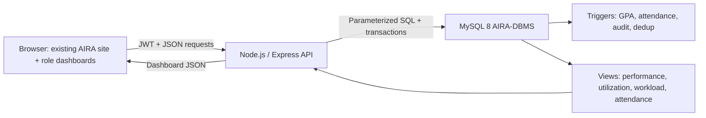
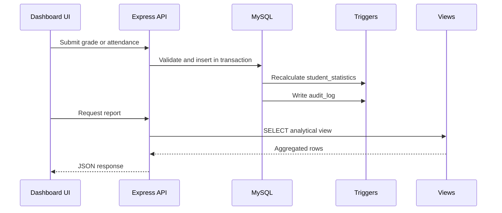

# AIRA-DBMS Architecture

```mermaid
flowchart LR
  Browser["Browser: existing AIRA site + role dashboards"]
  Express["Node.js / Express API"]
  MySQL["MySQL 8 AIRA-DBMS"]
  Triggers["Triggers: GPA, attendance, audit, dedup"]
  Views["Views: performance, utilization, workload, attendance"]

  Browser -->|"JWT + JSON requests"| Express
  Express -->|"Parameterized SQL + transactions"| MySQL
  MySQL --> Triggers
  MySQL --> Views
  Views --> Express
  Express -->|"Dashboard JSON"| Browser
```

## Data Flow

```mermaid
sequenceDiagram
  participant UI as Dashboard UI
  participant API as Express API
  participant DB as MySQL
  participant T as Triggers
  participant V as Views

  UI->>API: Submit grade or attendance
  API->>DB: Validate and insert in transaction
  DB->>T: Recalculate student_statistics
  DB->>T: Write audit_log
  UI->>API: Request report
  API->>V: SELECT analytical view
  V-->>API: Aggregated rows
  API-->>UI: JSON response
```

The implementation focuses on academic records, analytics, auditing, and authentication flows.
