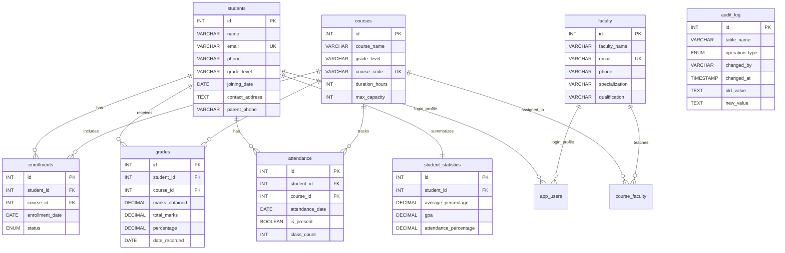

# AIRA-DBMS ER Diagram

```mermaid
erDiagram
  students ||--o{ enrollments : has
  courses ||--o{ enrollments : includes
  students ||--o{ grades : receives
  courses ||--o{ grades : assessed_in
  students ||--o{ attendance : has
  courses ||--o{ attendance : tracks
  students ||--|| student_statistics : summarizes
  courses ||--o{ course_faculty : assigned_to
  faculty ||--o{ course_faculty : teaches
  students ||--o{ app_users : login_profile
  faculty ||--o{ app_users : login_profile

  students {
    INT id PK
    VARCHAR name
    VARCHAR email UK
    VARCHAR phone
    VARCHAR grade_level
    DATE joining_date
    TEXT contact_address
    VARCHAR parent_phone
  }

  courses {
    INT id PK
    VARCHAR course_name
    VARCHAR grade_level
    VARCHAR course_code UK
    INT duration_hours
    INT max_capacity
  }

  faculty {
    INT id PK
    VARCHAR faculty_name
    VARCHAR email UK
    VARCHAR phone
    VARCHAR specialization
    VARCHAR qualification
  }

  enrollments {
    INT id PK
    INT student_id FK
    INT course_id FK
    DATE enrollment_date
    ENUM status
  }

  grades {
    INT id PK
    INT student_id FK
    INT course_id FK
    DECIMAL marks_obtained
    DECIMAL total_marks
    DECIMAL percentage
    DATE date_recorded
  }

  attendance {
    INT id PK
    INT student_id FK
    INT course_id FK
    DATE attendance_date
    BOOLEAN is_present
    INT class_count
  }

  student_statistics {
    INT id PK
    INT student_id FK
    DECIMAL average_percentage
    DECIMAL gpa
    DECIMAL attendance_percentage
  }

  audit_log {
    INT id PK
    VARCHAR table_name
    ENUM operation_type
    VARCHAR changed_by
    TIMESTAMP changed_at
    TEXT old_value
    TEXT new_value
  }
```
